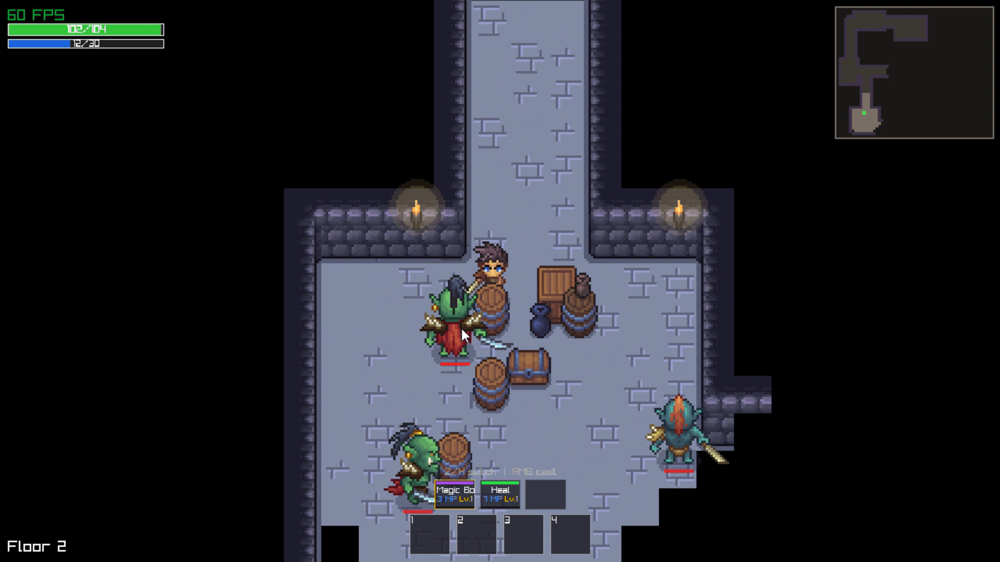
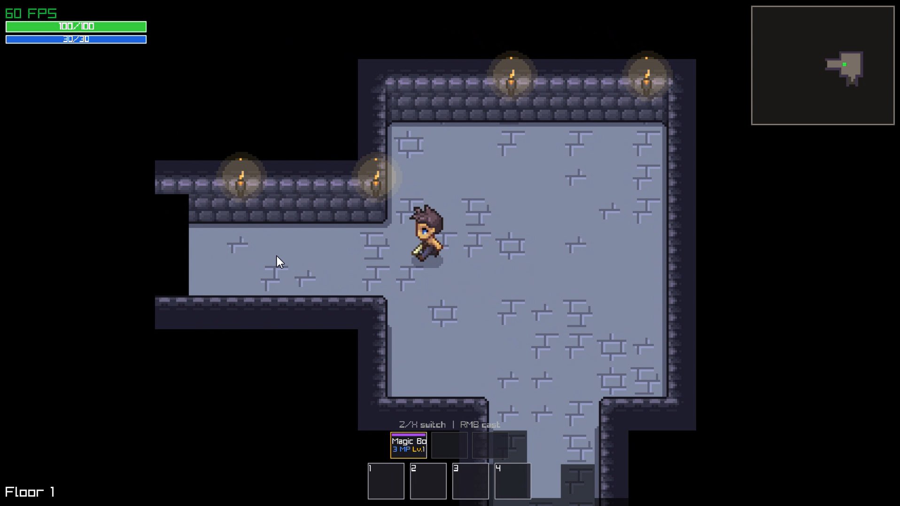
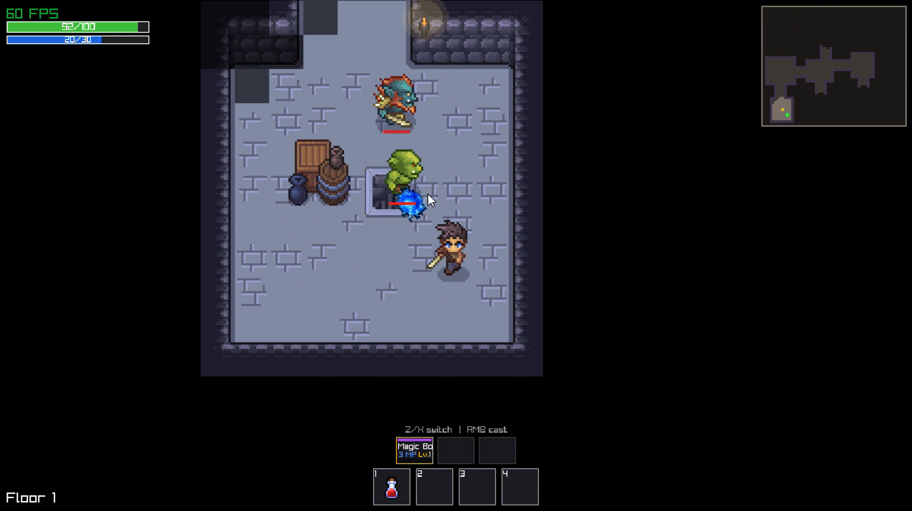
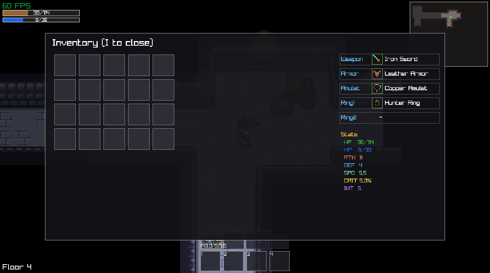

# Dungeon of Shadows

Action Roguelike с процедурными подземельями, реалтайм-боем, системой магии и permadeath.
Написан на C# 12 + Raylib-cs + NativeAOT.

<p align="center">
  
  
</p>
<p align="center">
  
  
</p>

## Возможности

- **Процедурные подземелья** — BSP-генерация этажей с 8-14 комнатами, L-образные коридоры, туман войны, декорации, масштабирование каждые 5 уровней
- **Реалтайм-бой** — Атаки ближнего боя, дэш с i-frames, 3 типа врагов с A* навигацией
- **Система магии** — 6 заклинаний (Magic Bolt, Fireball, Frost Nova, Chain Lightning, Shadow Step, Heal), мана, кулдауны, статус-эффекты (Burn, Slow)
- **Лут и экипировка** — Мечи, броня, кольца, амулеты, зелья, свитки заклинаний. Уровни редкости, инвентарь, быстрые слоты
- **Пиксель-арт** — 16x16 спрайты, анимированные персонажи, Y-сортировка глубины, туман войны

## Технологии

| | |
|---|---|
| Язык | C# 12 / .NET 8 |
| Графика | [Raylib-cs](https://github.com/ChristopherRae/Raylib-cs) 6.1.1 |
| DI | Microsoft.Extensions.DependencyInjection |
| Компиляция | NativeAOT (единый бинарник, без рантайма) |
| Архитектура | Собственный ECS (Entity Component System) |
| Данные | JSON-конфиги с AOT-совместимыми source generators |

## Сборка и запуск

**Требования:** .NET 8 SDK

```bash
# Разработка
dotnet run --project DungeonOfShadows.csproj

# Релиз (NativeAOT)
dotnet publish -c Release -r win-x64 -p:PublishAot=true
dotnet publish -c Release -r linux-x64 -p:PublishAot=true
dotnet publish -c Release -r osx-arm64 -p:PublishAot=true
```

## Управление

| Клавиша | Действие |
|---------|----------|
| WASD | Движение |
| ЛКМ | Атака ближнего боя |
| ПКМ | Каст заклинания |
| Z / X / Колесо мыши | Переключение слота заклинания |
| Shift | Дэш |
| E / Space | Спуск по лестнице |
| 1-4 | Использование предмета из быстрого слота |
| Tab | Инвентарь |
| F3 | Дебаг-оверлей |

## Архитектура

Легковесный ECS с DI-управляемым жизненным циклом систем:

```
Start() → Tick(dt) → Dispose()
   ↑          ↑          ↑
однократно  каждый кадр  при выходе
```

Системы независимы — общаются через разделяемые данные (компоненты `World`, флаги `GameContext`, очереди событий). Порядок регистрации в `ServiceRegistration.cs` определяет порядок тика.

```
src/
├── Core/           — Game loop, конфиг, DI, загрузка ассетов
├── ECS/
│   ├── Core/       — World, ComponentStore, интерфейсы жизненного цикла
│   ├── Player/     — Обработка ввода
│   ├── Physics/    — Движение, коллизии
│   ├── Combat/     — Ближний бой, дэш, AI, здоровье, урон
│   ├── Magic/      — Заклинания, снаряды, статус-эффекты, мана
│   ├── Items/      — Инвентарь, экипировка, лут, сундуки
│   ├── Exploration/ — Генерация подземелий, FOV, переходы этажей
│   └── Rendering/  — Спрайты, тайлы, анимации, HUD, UI
├── UI/             — Layout, отрисовка, тема, маршрутизация ввода
└── Dungeon/        — Тайловая карта, BSP, размещение комнат, коридоры
```

## Дорожная карта

| Фаза | Статус |
|------|--------|
| Ядро (окно, движение, камера) | Готово |
| Генерация подземелий (BSP, FOV, мини-карта) | Готово |
| Бой (ближний бой, AI, дэш) | Готово |
| Предметы (лут, инвентарь, экипировка) | Готово |
| Магия (заклинания, снаряды, эффекты) | Готово |
| Прогрессия (XP, уровни, перки) | Планируется |
| Боссы (уникальные встречи, арены) | Планируется |
| Полировка (аудио, баланс, частицы) | Планируется |

## CI/CD

- **PR Review** — Автоматическое код-ревью при создании PR через GitHub Models API
- **Dev Build** — NativeAOT-сборка + тег версии при мердже PR в `develop`

## Лицензия

Все права защищены.
